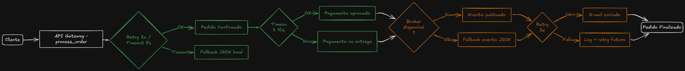

# 🛒 Mercadinho 24h

Sistema de processamento de pedidos com implementação de padrões de resiliência: **Retry**, **Timeout** e **Fallback**.

## 📋 Sobre o Projeto

O Mercadinho 24h é uma aplicação educacional que demonstra como implementar estratégias de resiliência em sistemas distribuídos. O projeto simula um fluxo completo de e-commerce, desde a seleção de produtos até o processamento do pedido, com tratamento robusto de falhas.

### Padrões Implementados

- **🔄 Retry**: Reexecução automática com backoff exponencial
- **⏱️ Timeout**: Cancelamento de operações que excedem tempo limite
- **↩️ Fallback**: Estratégias alternativas quando serviços estão indisponíveis

## 🏗️ Arquitetura



O fluxo completo do sistema segue a seguinte estrutura:

1. **Cliente** → Envia pedido para o API Gateway
2. **API Gateway (process_order)** → Orquestra todo o fluxo com padrões de resiliência
3. **Order Service** → Confirma pedido (com Retry 3x + Timeout 5s)
   - ✅ **Sucesso**: Pedido confirmado
   - ⏱️ **Timeout**: Fallback para JSON local
4. **Payment Service** → Processa pagamento (com Timeout 10s)
   - ✅ **Sucesso**: Pagamento aprovado
   - ❌ **Erro**: Fallback para "pagamento na entrega"
5. **Message Broker** → Publica evento (assíncrono)
   - ✅ **Sucesso**: Evento publicado
   - ❌ **Offline**: Fallback para JSON local
6. **Notification Service** → Envia e-mail (best-effort com Retry 3x)
   - ✅ **Sucesso**: E-mail enviado
   - ⚠️ **Falha**: Log para retry futuro
7. **Pedido Finalizado** → Retorna resultado ao cliente

## 🚀 Como Executar

### Pré-requisitos

- Python 3.7+
- Nenhuma dependência externa (usa apenas biblioteca padrão)

### Executando o Projeto

```bash
python loja.py
```

### Modos de Teste Disponíveis

1. **Compra normal (fluxo feliz)** - Todos os serviços funcionando
2. **Teste RETRY** - Order Service instável (recupera após 2 tentativas)
3. **Teste TIMEOUT** - Order Service lento (excede limite de tempo)
4. **Teste FALLBACK - Payment** - Payment Gateway offline
5. **Teste FALLBACK - Broker** - Message Broker offline

## 📁 Estrutura do Projeto

```
mercadinho-24h/
├── loja.py                    # Interface de compra (CLI)
├── gateway.py                 # Gateway com padrões de resiliência
├── arquitetura.png            # Diagrama da arquitetura do sistema
├── fallback_orders.json       # Arquivo de fallback (gerado automaticamente)
└── README.md                  # Este arquivo
```

## 🔍 Detalhamento dos Componentes

### `gateway.py` - API Gateway

#### Funções de Resiliência

**`with_retry(coro_fn, max_attempts=3, base_delay=0.5)`**
- Implementa retry com backoff exponencial
- Útil para falhas transientes (rede instável, serviço temporariamente indisponível)
- Delay aumenta: 0.5s → 1s → 2s

**`with_timeout(coro, seconds)`**
- Cancela operações que excedem o tempo limite
- Previne travamento do sistema
- Retorna erro claro ao usuário

**`save_fallback_order(order)`**
- Persiste pedidos em JSON local quando broker está offline
- Permite reprocessamento posterior
- Garante que nenhum pedido seja perdido

**`payment_fallback(order)`**
- Aceita pedido mesmo com gateway de pagamento offline
- Marca para "pagamento na entrega"
- Mantém operação do negócio

#### Fluxo de Processamento

```python
async def process_order(order, simulate=None):
    # 1. Order Service (sync/RPC)
    #    ├─ Retry: até 3 tentativas
    #    └─ Timeout: máximo 5 segundos
    
    # 2. Payment Service (sync/RPC)
    #    ├─ Timeout: máximo 10 segundos
    #    └─ Fallback: pagamento na entrega
    
    # 3. Message Broker (async)
    #    └─ Fallback: salva em JSON local
    
    # 4. Notification (async, best-effort)
    #    └─ Retry: até 3 tentativas, falha silenciosa
```

### `loja.py` - Interface de Compra

Interface CLI amigável com:
- Catálogo de 8 produtos
- Carrinho de compras
- 3 opções de pagamento
- Resumo detalhado do processamento

## 🧪 Cenários de Teste

### 1. Fluxo Feliz
```
→ Order Service: ✓ confirmado
→ Payment Service: ✓ aprovado
→ Broker: ✓ evento publicado
→ Notification: ✓ e-mail enviado
```

### 2. Retry - Order Service Instável
```
→ Tentativa 1: ✗ falha (ConnectionError)
→ Aguarda 0.5s...
→ Tentativa 2: ✗ falha (ConnectionError)
→ Aguarda 1.0s...
→ Tentativa 3: ✓ sucesso
```

### 3. Timeout - Order Service Lento
```
→ Order Service demora 10s
→ Timeout após 5s
→ FALLBACK: pedido salvo em fallback_orders.json
```

### 4. Fallback - Payment Offline
```
→ Payment Gateway offline
→ FALLBACK: aceito "pagamento na entrega"
→ Pedido prossegue normalmente
```

### 5. Fallback - Broker Offline
```
→ Message Broker offline
→ FALLBACK: evento salvo em fallback_orders.json
→ Notificação é enviada mesmo assim
```

## 📊 Exemplo de Saída

```
=======================================================
        🛒  MERCADINHO 24H  🛒
=======================================================

🧪 MODO DE EXECUÇÃO:
  [1] Compra normal (fluxo feliz)
  [2] Teste RETRY — Order Service instável
  [3] Teste TIMEOUT — Order Service lento
  [4] Teste FALLBACK — Payment offline
  [5] Teste FALLBACK — Broker offline

Escolha o modo: 4

=======================================================
PROCESSANDO PEDIDO ORD-A1B2C3D4
=======================================================

→ [1/4] Order Service (sync, RPC)
  [RETRY] OrderService tentativa 1/3
  ✓ Pedido confirmado: ORD-A1B2C3D4

→ [2/4] Payment Service (sync, RPC)
  ✗ RuntimeError: Payment Gateway offline
  ↩ FALLBACK: Pagamento indisponível - aceito pagamento na entrega

→ [3/4] Message Broker (async, mensageria)
  ✓ Evento publicado: ORDER_COMPLETED / pedido ORD-A1B2C3D4

→ [4/4] Notification Service (async, best-effort)
  ✓ E-mail enviado para pedido ORD-A1B2C3D4

=======================================================
✓ PEDIDO ORD-A1B2C3D4 FINALIZADO
=======================================================

✅  COMPRA FINALIZADA COM SUCESSO!

  Pedido:  ORD-A1B2C3D4
  Pagamento: Pagamento indisponível - aceito pagamento na entrega

  Etapas processadas:
    ✓ ORDER           [ok] 
    ↩ PAYMENT         [fallback] 
    ✓ BROKER          [ok] 
    ✓ NOTIFICATION    [ok] 

  Pedido processado com sucesso!
```

## 💡 Conceitos Demonstrados

### Comunicação Síncrona vs Assíncrona

- **Síncrona (RPC)**: Order Service, Payment Service
  - Cliente espera resposta antes de continuar
  - Precisa de timeout e retry
  
- **Assíncrona (Mensageria)**: Broker, Notification
  - Fire-and-forget
  - Permite fallback sem bloquear fluxo principal

### Best-Effort vs Garantia

- **Best-Effort**: Notification Service
  - Tenta enviar, mas falha silenciosa é aceitável
  - Pode ser reprocessado depois via logs

- **Garantia**: Order Service, Payment Service
  - Falha bloqueia o pedido
  - Requer estratégia de recuperação (retry/fallback)

### Backoff Exponencial

```python
delay = base_delay * (2 ** (attempt - 1))
# Tentativa 1: 0.5s
# Tentativa 2: 1.0s
# Tentativa 3: 2.0s
```

Evita sobrecarga do serviço em recuperação.

## 🔧 Personalizando

### Ajustando Timeouts

```python
# Em gateway.py, na função process_order()

# Order Service
await with_timeout(..., seconds=5)  # Altere aqui

# Payment Service
await with_timeout(..., seconds=10)  # Altere aqui
```

### Ajustando Retry

```python
# Em with_retry()
max_attempts=3      # Número de tentativas
base_delay=0.5      # Delay inicial em segundos
```

### Adicionando Produtos

```python
# Em loja.py, no dicionário CATALOG
"9": {"name": "Novo Produto", "price": 10.00},
```

## 📚 Casos de Uso Reais

Este padrão é usado em:

- **E-commerce**: Amazon, Mercado Livre
- **Fintech**: Nubank, PicPay
- **Delivery**: iFood, Uber Eats
- **SaaS**: Stripe, Twilio

## 🎯 Objetivos de Aprendizado

Ao explorar este projeto, você aprenderá:

✅ Como implementar retry com backoff exponencial  
✅ Quando usar timeout e como configurá-lo  
✅ Estratégias de fallback para manter disponibilidade  
✅ Diferença entre comunicação síncrona e assíncrona  
✅ Como lidar com falhas parciais em sistemas distribuídos  
✅ Padrões de resiliência recomendados pela indústria  

## 📖 Referências

- [Microsoft - Retry Pattern](https://docs.microsoft.com/azure/architecture/patterns/retry)
- [AWS - Timeouts and Retries](https://aws.amazon.com/builders-library/timeouts-retries-and-backoff-with-jitter/)
- [Google - Site Reliability Engineering](https://sre.google/sre-book/table-of-contents/)

## 📝 Licença

Este é um projeto educacional livre para uso e modificação.

---

**Desenvolvido para demonstrar padrões de resiliência em sistemas distribuídos** 🚀